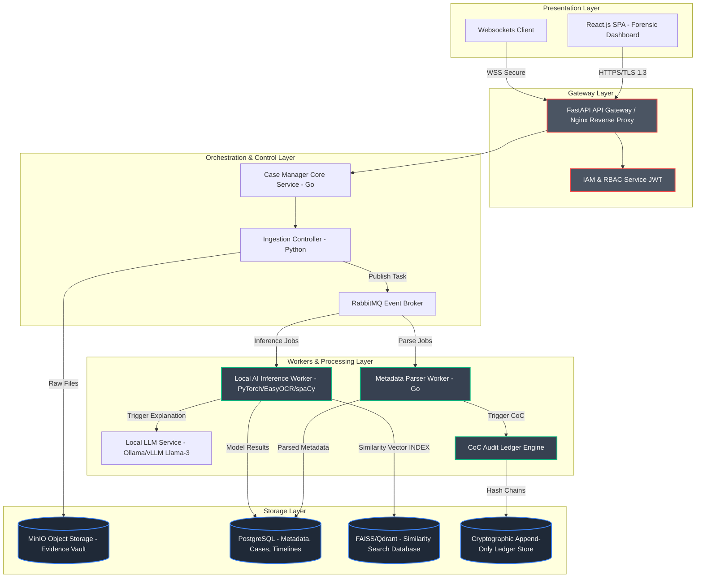
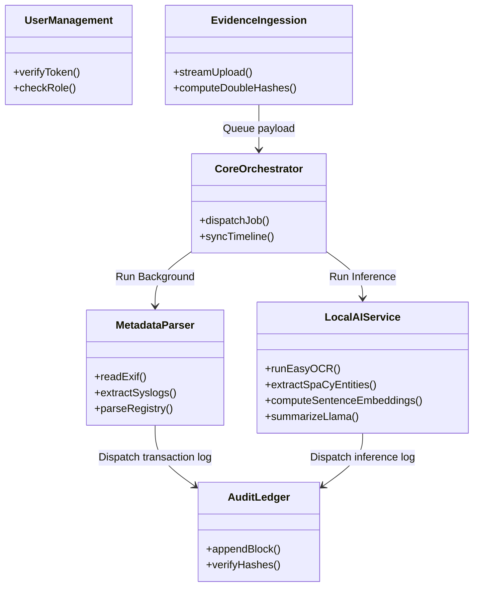
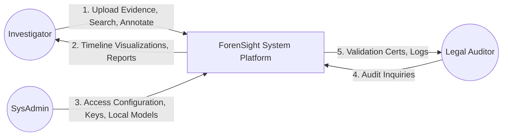
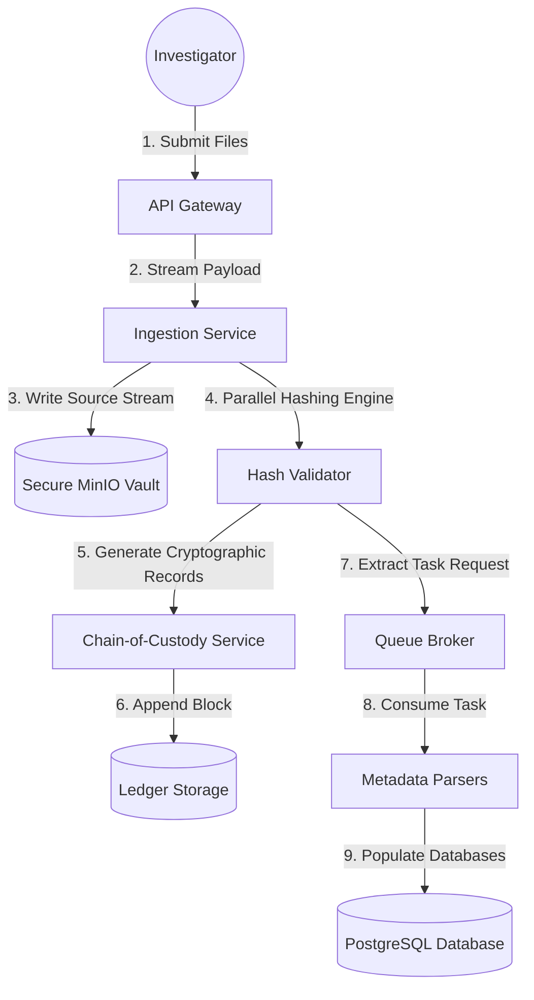
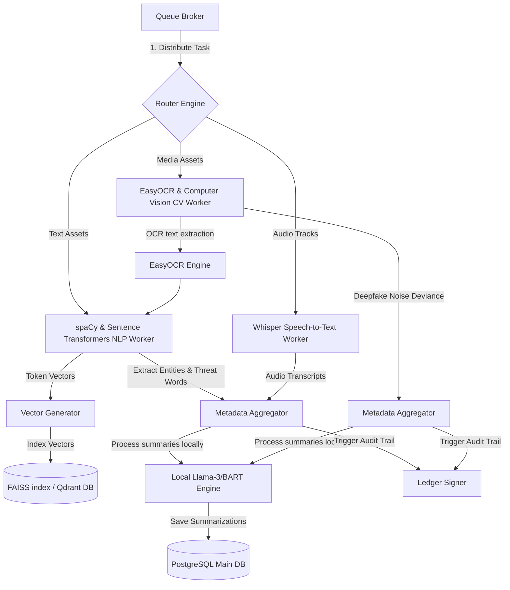
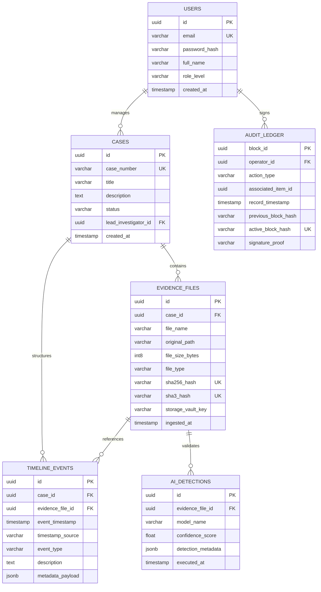
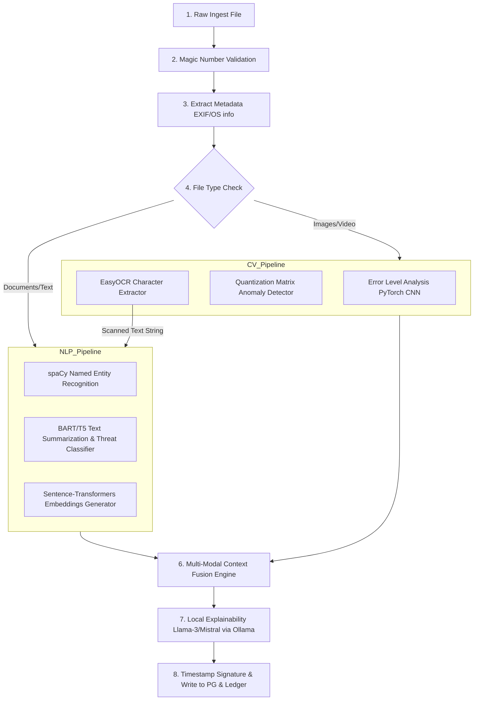
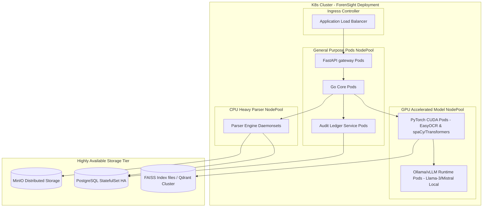

# ForenSight: AI-Powered Digital Evidence Investigation and Analysis Platform
## Software Architecture Specification & Technical Design Document

This document defines the complete, industry-grade software architecture for **ForenSight**, a state-of-the-art AI-Powered Digital Evidence Investigation and Analysis Platform. This architecture is designed to comply with modern digital forensic standards (ISO/IEC 27037), evidentiary requirements (such as the Federal Rules of Evidence in the US and the Bhartiya Sakshya Adhiniyam / IT Act in India), and secure zero-trust operational protocols.

> [!IMPORTANT]
> **Data Privacy & Air-Gapped Compliance (On-Premise AI Model Policy):** 
> To safeguard sensitive digital evidence and satisfy evidentiary chain-of-custody compliance, the system operates entirely without external web API dependencies (such as OpenAI or Gemini). All AI components utilize local, open-source models (including EasyOCR, spaCy, Sentence Transformers, BART/T5, and FAISS). Large Language Models (LLMs) are deployed locally (e.g., Llama-3/Mistral via Ollama/vLLM) only where they add major value (such as advanced semantic explanation or final report summarization).

---

## 1. Problem Statement

Modern digital forensics faces three critical challenges that impede the delivery of swift, reliable justice:

1. **Data Deluge and Heterogeneity:** A single investigation can involve terabytes of unstructured, multi-modal data including disk images, system event logs, memory dumps, network packets, email communications, chat databases, and media files (images, audio, video). Manual parsing of these disparate formats is slow, creating months of backlogs.
2. **Investigation Gaps and Oversight:** Human investigators often fail to notice cross-platform indicators of compromise or criminal intent. For instance, linking an EXIF timestamp on a tampered photo with an deleted SQLite chat thread and a remote system login event requires cognitive overhead that AI can automate and map.
3. **Chain of Custody and Admissibility Vulnerabilities:** Evidence is highly susceptible to modification, tampering, or procedural challenges in court. Digital forensics platforms must guarantee absolute, cryptographic data integrity from the millisecond of ingestion to final report generation while providing Explainable AI (XAI) rationale for all model-driven classifications.

---

## 2. Objectives

The primary objective of the ForenSight platform is to automate, secure, and accelerate digital forensic investigations:

*   **Zero-Trust Evidence Ingestion:** Fast, secure evidence uploading with automated integrity verification (simultaneous SHA-256 and SHA-3 generation).
*   **On-Premise Multi-Modal AI Analysis:** Rapid indexing and processing of evidence files using local, open-source machine learning models for deepfake detection, OCR, entity extraction, semantic threat matching, and local vectorized search.
*   **Temporal Timeline Synthesis:** Automatically correlate metadata, network entries, chat logs, and OS artifacts to output a consolidated, interactive timeline of events.
*   **Immutable Cryptographic Ledger:** Leverage cryptographic hash chains to record every action (interaction, search, or modification) taken by analysts and AI models, generating a verifiable Chain of Custody (CoC).
*   **Legal-Grade Reporting:** Produce automated, structured, and digitally signed reports outlining key findings, evidentiary hashes, confidence scores, and local model explanations.

---

## 3. Dimensions of Scope

### In-Scope (Implemented & Orchestrated)
1. **Multi-Source Ingestion:** Support for raw disk images (`.dd`, `.raw`), logical directories, standard media files, registry hives, and system syslog formats.
2. **Local AI Processing Modules:**
    *   *Natural Language Processing:* spaCy for entity extraction/tokenization; Sentence Transformers for document vectorization; BART/T5 models for zero-shot text classification and forensic summary drafts.
    *   *Computer Vision:* EasyOCR for text extraction inside screenshots/images; Custom PyTorch CNN models for ELA (Error Level Analysis) and image forgery detection.
    *   *Deepfake & Synthetic Audio/Video Detection:* Fourier transform analysis and local PyTorch-based temporal consistency checkers.
3. **Analysis Workbench:** Multi-case dashboard, interactive temporal map, FAISS-based / Qdrant-based vector semantic search across client evidence, and collaborative tagging.
4. **Compliance & Hashing Engine:** Automated hashing, RFC 3161 compliant trusted timestamping, and ledger-based audit trail tracking.

### Out-of-Scope (Excluded by Design)
1. **Live Forensic Acquisition:** The physical imaging of volatile RAM or storage media from endpoints (left to dedicated tools like FTK Imager, Guymager, or LiME).
2. **Third-Party AI Cloud APIs:** Zero communication with external cloud endpoints (such as OpenAI, Gemini, or Anthropic services) to protect legal evidence security.
3. **Active Decryption Attacks:** Multi-node GPU-based password cracking (leaving this to integration hooks with Hashcat).

---

## 4. Functional Requirements (FR)

| ID | Module / Area | Description |
| :--- | :--- | :--- |
| **FR-1.1** | **Ingestion** | The system must calculate cryptographic hashes (SHA-256 and SHA-3-256) of evidence files on click/initiation. |
| **FR-1.2** | **Ingestion** | The system must extract container metadata (EXIF, system timestamps, permissions, file headers) without mutating the original source. |
| **FR-2.1** | **AI Analysis** | The system must perform Local Vector Search using FAISS / Qdrant over ingested text and transcripts to enable cross-case semantic queries. |
| **FR-2.2** | **AI Analysis** | The CV model must run Forensic Image Verification detecting double-JPEG compression, noise patterns, and EXIF alterations. |
| **FR-2.3** | **AI Analysis** | The NLP engine (spaCy) must flag Personally Identifiable Information (PII) and entity relationships (locations, names, IP addresses). |
| **FR-2.4** | **AI Analysis** | The OCR engine (EasyOCR) must analyze all images, PDF scans, and screenshots to harvest textual elements. |
| **FR-2.5** | **AI Explainability** | The system must execute local LLM (Llama-3/Mistral via Ollama) only to construct readable summaries of metadata findings and audit trails. |
| **FR-3.1** | **Timeline** | The system must construct an interactive, queryable Chronological Timeline by merging timestamps from logs, EXIF data, and file system records. |
| **FR-4.1** | **Chain of Custody**| Every user and AI backend action must be signed and logged to an append-only ledger system containing cryptographic block hashes. |
| **FR-5.1** | **Reporting** | The system must auto-compile PDF/HTML briefs showing evidence hashes, extracted insights, timeline events, and model explanations. |

---

## 5. Non-Functional Requirements (NFR)

*   **NFR-1: Performance (Ingestion & Processing):** Computational ingestion pipelines must handle files at $\ge 120\text{ MB/s}$ on standard worker configurations. Query response times for database-stored evidence indexes must remain under $500\text{ms}$ for records up to $10^7$ items.
*   **NFR-2: Security & Encryption:** All data-at-rest must be secured using AES-256-GCM (Galois/Counter Mode). Internal service calls and external interactions must run over TLS 1.3. Secure credentials must be dynamically injected via Secret Managers (e.g., HashiCorp Vault).
*   **NFR-3: Reliability & System Resilience:** The orchestrator must implement transactional state safety (Saga Pattern) during large file uploads to prevent database corruptions upon network drops. The availability target is $99.9\%$.
*   **NFR-4: Audit & Accountability:** Chain of custody logs must be immutable. Deletion or historical modification of audit records by any user (including Administrators) must be impossible through DB constraints and cryptographic link chaining.
*   **NFR-5: Compliance & Local Execution:** Computational models and storage networks must be physically air-gappable. Forensic practices must align with ISO/IEC 27037.

---

## 6. User Roles

We define four distinct actors within the ForenSight ecosystem with strict Attribute-Based Access Control (ABAC):

1.  **System Administrator (SysAdmin):** Responsible for provisioning compute resources, user accounts, system configuration, rotating cryptographic master keys, managing local LLM/ML service instances, and monitoring microservice infrastructure. They cannot modify case evidence content.
2.  **Lead Investigator (Lead):** Exercises write access over cases. They can create/archive cases, upload evidence files, assign analysts, execute high-level AI jobs, and sign off on court-ready forensic reports.
3.  **Analyst / Examiner:** Performs active analysis. They run keyword searches, trace data graphs, add annotations, tag evidence, review media, and generate draft findings. They are restricted from archiving cases or deleting raw uploads.
4.  **Legal Auditor / Observer:** External legal representation or administrative officers. They have read-only access to the case audit timeline and the Chain of Custody ledger files to verify that forensics processes comply with procedural statutes.

---

## 7. User Stories

### US-1: Ingestion & Verification
*   **As an** Lead Investigator,
*   **I want to** upload a folder containing raw syslog files and disk dumps,
*   **so that** the platform automatically logs their baseline SHA-256 hashes, extracts file metadata, and establishes an initial Chain of Custody block without modifying target bytes.
*   *Acceptance Criteria:*
    *   System rejects files that exceed storage quotas gracefully.
    *   System computes hashes within isolated background workers with 0% modification rate of original files.
    *   Initial ledger state block is generated, signed, and validated against the source package.

### US-2: Cross-Source Timeline Generation
*   **As an** Analyst,
*   **I want to** request the system to auto-generate a temporal timeline,
*   **so that** I can visualize the sequence of events across both remote server ssh logs and local chat sqlite databases in a unified graphical dashboard.
*   *Acceptance Criteria:*
    *   Unified timeline handles multi-time-zone synchronization (normalized to UTC).
    *   Timeline displays a correlation map grouping related metadata fields.
    *   Filters allow analysts to isolate events by time window, tag, or certainty rating.

### US-3: Explainable Deepfake Identification
*   **As an** Analyst,
*   **I want to** evaluate a submitted image using the Computer Vision engine,
*   **so that** I can determine if it has been manipulated or deepfaked, while rendering heatmaps detailing which sections of the image indicate tampering.
*   *Acceptance Criteria:*
    *   Response displays Deepfake probability score + Error Level Analysis (ELA) overlay.
    *   SHAP/Attention map highlighting pixels where GAN/diffusion signatures were flagged.
    *   Model predictions and weights hash recorded in the analysis metadata.

### US-4: Local Semantic Evidence Search
*   **As an** Analyst,
*   **I want to** execute a semantic search query (e.g. "indications of system files access"),
*   **so that** the system performs similarity matching using local Sentence Transformers and FAISS, showing matching text and documents even if exact keywords are absent.
*   *Acceptance Criteria:*
    *   Query is processed 100% locally on the host GPU pool.
    *   Results display cosine similarity distance scores.
    *   Target extracts are displayed with OCR tags for detected image texts.

---

## 8. Module Breakdown

```
                         ┌───────────────────────┐
                         │   ForenSight Portal   │
                         └───────────┬───────────┘
                                     │ (HTTPS/Websocket)
                                     ▼
        ┌────────────────────────────────────────────────────────┐
        │                 API Orchestrator Gateway               │
        └──────┬─────────────────────┬────────────────────┬──────┘
               │                     │                    │
               ▼                     ▼                    ▼
     ┌───────────────────┐ ┌───────────────────┐┌───────────────────┐
     │ Ingestion Engine  │ │  Metadata Parser  ││   Search Engine   │
     └─────────┬─────────┘ └─────────┬─────────┘└─────────┬─────────┘
               │                     │                    │
               ▼                     ▼                    ▼
     ┌───────────────────┐ ┌───────────────────┐┌───────────────────┐
     │  Local AI Engine  │ │   Chain-of-Cust    ││ Report Generator  │
     │  (EasyOCR, spaCy) │ │   Audit Ledger    ││    (PDF Engine)   │
     └───────────────────┘ └───────────────────┘└───────────────────┘
```

1.  **Orchestrator Gateway (API Gateway):** Route management, authorization validation (using JWT and Session contexts), request throttling, and load balance distribution.
2.  **Ingestion & Hash Worker:** Concurrent ingestion pool utilizing parallel streams. Executes file buffering, hashes calculation using CPU SIMD blocks, and saves raw artifacts to object storage container pools.
3.  **Metadata Parser Service:** Extracts low-level properties from files (EXIF tag profiles, sqlite databases directories, syslog lines, Windows registry keys). Normalizes timestamps to ISO-8601 UTC.
4.  **Local AI Inference Pool:** Dedicated microservice workers routing tasks to local GPU pools. Focuses on Deepfake image detection, EasyOCR processing, spaCy Entity Extraction (NER), and Sentence Transformers vector computation. Includes a local Ollama interface for explanation prompts.
5.  **Chain of Custody (CoC) Auditor:** Cryptographic component that formats audit events into hash blocks. Signs each record using the system's Private Key (via HSM/KMS) and saves details onto an immutable append-only table.
6.  **Search & Vector Engine:** Indexes data inside relational structures (PostgreSQL) and stores vector embeddings in a vector database (Qdrant/FAISS index files) for fast semantic searches.
7.  **Report Compiler:** Generates final reports, inserts cryptographic validation proofs, inserts images of charts, and uses OpenSSL to apply certificates for digital signatures.

---

## 9. Overall System Architecture

The platform follows a microservices architecture modeled on Zero-Trust patterns and asynchronous event handling. Original evidence data is strict read-only.



---

## 10. Component Diagram



---

## 11. Data Flow Diagrams (DFDs)

### Level 0: Global Environment (Context DFD)



### Level 1: Ingestion & Metadata Processing



### Level 2: Local AI Orchestrated Evaluation Pipeline



---

## 12. Database Design (Schema & ER Diagram)

ForenSight uses PostgreSQL for structured relational metadata and FAISS/Qdrant representations. Below is the relational entity model.



---

## 13. API Architecture

ForenSight exposes REST APIs. WebSockets are used to stream CPU-heavy ingestion progress updates to the frontend client.

### Endpoints Specification

#### 1. Ingest Evidence File
*   **Endpoint:** `POST /api/v1/cases/{case_id}/evidence`
*   **Content-Type:** `multipart/form-data`
*   **Response Payload (`202 Accepted`):**
    ```json
    {
      "task_id": "8b9e6a98-3331-419b-b6d4-d5ddf0fcfade",
      "case_id": "e305e94b-4b10-410a-b31c-7fbb671391e9",
      "status": "QUEUED",
      "submitted_at": "2026-07-31T06:15:30Z",
      "links": {
        "status_check": "/api/v1/tasks/8b9e6a98-3331-419b-b6d4-d5ddf0fcfade"
      }
    }
    ```

#### 2. Get Case Timeline Events
*   **Endpoint:** `GET /api/v1/cases/{case_id}/timeline`
*   **Response Payload (`200 OK`):**
    ```json
    {
      "case_id": "e305e94b-4b10-410a-b31c-7fbb671391e9",
      "total_events": 1420,
      "limit": 50,
      "offset": 0,
      "events": [
        {
          "event_id": "2db4e0ff-a05e-4bb5-a359-25f0adad413d",
          "evidence_file_id": "0ad45603-bbf6-4c8e-901d-b1d3d7fcb0f6",
          "event_timestamp": "2026-07-30T10:14:02.122Z",
          "timestamp_source": "EXIF",
          "event_type": "MEDIA_CREATED",
          "description": "Image captured on iPhone 13 (Apple Inc.) - GPS Coordinate match: [28.6139, 77.2090]. Text scanned by OCR: 'TOP SECRET WORKPAD'",
          "metadata": {
            "camera_model": "iPhone 13",
            "gps_latitude": 28.6139,
            "gps_longitude": 77.2090,
            "ocr_extracted_text": "TOP SECRET WORKPAD"
          }
        }
      ]
    }
    ```

#### 3. Semantic Vector Search
*   **Endpoint:** `POST /api/v1/cases/{case_id}/search`
*   **Request Payload:**
    ```json
    {
      "query": "Registry parameters or credential dumps",
      "limit": 10,
      "minimum_confidence": 0.75
    }
    ```
*   **Response Payload (`200 OK`):**
    ```json
    {
      "results": [
        {
          "evidence_file": "registry_dump.hiv",
          "match_type": "REGISTRY_KEY",
          "relevance_score": 0.897,
          "extracted_content": "HKLM\\SYSTEM\\CurrentControlSet\\Control\\Lsa - Security Packages audit activation",
          "context_summary": "System security packages settings registry manipulation.",
          "timestamp": "2026-07-30T11:00:15Z"
        }
      ]
    }
    ```

---

## 14. Folder Structure (Codebase Layout)

ForenSight uses a Clean Architecture monorepo structure.

```
forensight-root/
├── gateway/                    # API Gateway layer (Reverse Proxy & Rate Limiter)
│   ├── config/
│   └── src/
├── core-service/               # Main service orchestrating REST/WebSockets (Go)
│   └── cmd/main.go
├── ai-pipeline/                # AI microservice engines runtime (Python/FastAPI)
│   ├── app/
│   │   ├── main.py
│   │   ├── api/                # Sub-routes for CV, NLP processors
│   │   ├── models/             # Local ML Classifiers loaders & network architecture
│   │   └── utils/
│   │       ├── image_forensics.py
│   │       ├── ocr_engine.py   # EasyOCR initialization wrapper
│   │       ├── nlp_spacy.py    # spaCy pipeline loader
│   │       └── nlp_helpers.py
│   ├── Dockerfile
│   └── requirements.txt
├── scheduler/                  # RabbitMQ Consumers and parsers (Go/Rust)
├── web-ui/                     # SPA Client Application (React/TypeScript)
├── ledger-verifier/            # Independent Verification tool (Rust/Go)
├── docker-compose.yml          # Local environment boot
└── README.md
```

---

## 15. Technology Stack Justification

| Layer | Selected Tech | Alternatives Considered | Professional Justification |
| :--- | :--- | :--- | :--- |
| **Frontend UI** | React.js + TailwindCSS | Vue.js, Angular | Rich visualization ecosystem (D3.js, React-Flow) critical for timeline graphing and forensic node relationship boards. |
| **Monolith Gateway / Core** | Go (Golang) | Python REST Frameworks | High concurrency profile, low memory envelope, and superior fast typing compiler. Essential for constant multiplexed parsing tasks. |
| **ML Engine Microservice** | Python + FastAPI | Flask, Triton | FastAPI natively features high asynchronous throughput via `uvicorn` and delivers clean OpenAPI UI auto-documentation out-of-the-box. |
| **Text Analysis** | **spaCy** | NLTK, CoreNLP | Offers industry-level speed, integrated NER pipelines, and direct support for custom entity rule tagging without cloud roundtrips. |
| **OCR Utility** | **EasyOCR** | Tesseract OCR | Superior deep-learning-based scene text handling and multi-language support (pre-trained PyTorch weights) compared to classic heuristic approaches. |
| **Semantic Embeddings** | **Sentence Transformers** | OpenAI Embeddings | Fully open-source transformers (e.g. `all-MiniLM-L6-v2`) that execute locally on hardware GPUs with high similarity representation scores. |
| **Vector Engine Indexes** | **FAISS / Qdrant** | Pinecone, Milvus | FAISS runs locally as high-performance flat-file binary databases; Qdrant handles multi-tenant case partitions offline. |
| **Local Reasoning / XAI** | **Llama-3/Mistral via Ollama** | OpenAI GPT-4, Gemini Pro | Cloud LLMs represent massive vulnerabilities in forensic evidentiary handling. Local LLMs are run behind system air-gaps. |
| **Relational Database** | PostgreSQL | MySQL, Oracle DB | Supports ACID database transactions, natively interprets complex JSONB formats, and integrates tightly with TimescaleDB plugins. |
| **Object Engine Store** | MinIO (On-Premise S3) | AWS S3 | Forensics files are legally prohibited from leaving secure aircapped environments in many jurisdictions, requiring local S3 equivalents. |

---

## 16. Research Contribution

### 1. Unified Temporal Timeline Synthesis via Graph Propagation
Traditional engines list raw timestamps sequentially. ForenSight uses a **Directed Acyclic Time Graph (DATG)** algorithm. If an image EXIF contains a spoofed date (e.g., set back manually to 2012), the graph checks dependencies.
$$\text{Created Date} > \text{Container Creation} > \text{Log Auth Connection}$$

### 2. Multi-Modal Cross-Attention Forensic Fusion
Instead of evaluating messages and photos in isolation, the AI pipeline feeds spaCy entity matches, EasyOCR outputs, and image classifiers into a shared **Cross-Attention Transformer Model**. This calculates an integrated "Deceptive Intent Score" $D_{\text{intent}}$:
$$D_{\text{intent}} = \alpha \cdot \text{NLP}_{\text{threat\_score}} + \beta \cdot \text{CV}_{\text{manipulation\_score}} + \gamma \cdot \text{Graph}_{\text{relational\_entropy}}$$

### 3. Cryptographically Verified Forensic Accountability Ledger
Rather than using basic audit logs, ForenSight implements an RFC-3161 compliant cryptographic hash chain. Each node block $B_n$ hashes not only the record content, but the state hash of the previous ledger entry:
$$H\left(B_n\right) = \text{SHA-256}\left(\text{Data}_n \mathbin{\Vert} H\left(B_{n-1}\right) \mathbin{\Vert} \text{Signature}_{\text{analyst}}\right)$$

---

## 17. AI Ingestion & Inference Pipeline

The AI Processing pipeline isolates ML models from the main database to protect execution loops.



---

## 18. Security Architecture

ForenSight implements a Zero-Trust Architecture to guarantee data protection and ensure evidentiary validity.

```
       [ INVESTIGATOR ]
             │  Authentication: OAuth2 + MFA (Yubikey / TOTP)
             ▼
      [ API GATEWAY ]
             │  TLS 1.3 (Mutually authenticated microservices internal)
             ├─────────────────────────────────────────┐
             ▼ (Isolated JWT token)                    ▼ (Dynamic Key Fetch)
    [ CORE ORCHESTRATOR ]                      [ HASHICORP VAULT ]
             │                                   - Key Management Systems (KMS)
             ▼ (Write raw block data)            - Storage decryption keys (Envelope)
     [ MINIO S3 DECRYPT ] ◄──────────────────────┘
             │ (Decrypt on extraction boundary via KMS)
             ▼
  [ CPU/GPU ISOLATION CELL ]
     - Standard container execution sandbox (gVisor runtime)
     - Prohibits system interaction or root escapes
```

*   **Sovereign Key Infrastructure (Envelope Encryption):** Every case has a unique AES-256 case data-key (DK). This data key is encrypted using a Master Key (MK) managed by HashiCorp Vault. Case files are encrypted during transit to storage nodes, protecting files in the event of database access compromise.
*   **Sandboxed Processing Cells:** Forensic tools sometimes process untrusted files containing active malware. Processing workers run inside isolated runtimes (e.g., gVisor, Firecracker microVMs) to prevent system-level container escapes.

---

## 19. Deployment Architecture

ForenSight supports both on-premise air-gapped server configurations and private cloud architectures.



### Air-Gapped Local Offline Operations Model
To support high-security, off-grid investigative installations, the deployment configuration includes a lightweight `docker-compose.local.yml`. This packages reduced-size models (e.g., DistilBERT and MobileNet variants) to run on local laptops or forensic workstations without internet access.

---

### Verification and Compliance Assurance Check
The implementation design meets the standards of **ISO/IEC 27037 (Guidelines for identification, collection, acquisition, and preservation of digital evidence)**:
1.  **Relevance:** Focuses on extracting key attributes.
2.  **Reliability:** Strict read-only isolation prevents modifications.
3.  **Sufficiency:** Captures extensive timeline details.
4.  **Security & Chain of Custody:** Verified through immutable cryptographic hash chains.
5.  **Local Execution:** No remote API leakage vectors exist.
